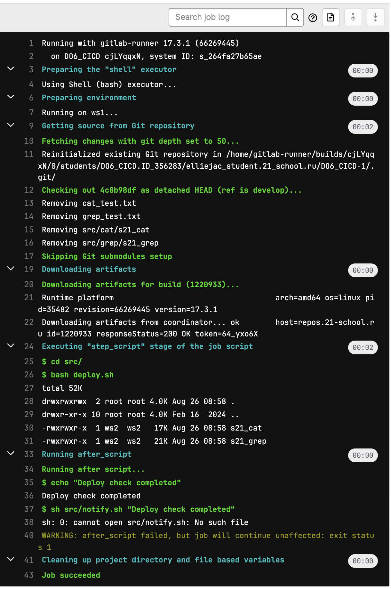

## Part 1. Настройка gitlab-runner

### Поднимаем виртуальную машину `Ubuntu Server 22.04 LTS`


### Скачать и установить на виртуальную машину **gitlab-runner**

> Был выбран метод установки gitlab-runner через [бинарный файл с официального сайта](https://docs.gitlab.com/runner/install/linux-manually.html)

1. Загрузить бинарный файл <br>
```sh
sudo curl -L --output /usr/local/bin/gitlab-runner "https://s3.dualstack.us-east-1.amazonaws.com/gitlab-runner-downloads/latest/binaries/gitlab-runner-linux-amd64"
```
2. Дать файлу разрешение на исполнение: <br>
```sh
sudo chmod +x /usr/local/bin/gitlab-runner
```
3. Создать пользователя GitLab CI <br>
```sh
sudo useradd --comment 'GitLab Runner' --create-home gitlab-runner --shell /bin/bash
```
4. Установить как службу <br>
```sh
sudo gitlab-runner install --user=gitlab-runner --working-directory=/home/gitlab-runner
```
5. Запустить службу
```sh
sudo gitlab-runner start
```


### Запустить **gitlab-runner** и зарегистрировать его для использования в текущем проекте (*DO6_CICD*)

> Для регистрации понадобятся URL и токен, которые можно получить на страничке задания на платформе


## Part 2. Сборка

### Cоздаем файл `.gitlab-ci.yml` в корне репрезитория 


### Проверяем сборку
## FAILED


- Изменим файл находящийся /home/gitlab-runner/.bash_logout


## Succsess

 


## Part 3. Тест кодстайла

### Напиcать этап для CI, который запускает скрипт кодстайла (clang-format)


- Проверим сначала вывод команды локально


### Формат кода соответсвует параметрам форматирования 

- Результат работы пайплайна


-  Проект успешно проходит тест кодстайла


<br>


## Part 4. Интеграционные тесты

### Этап для CI, который запускает интаграционные тесты


### Результат об успешном прохождении тестов


## Part 5. Этап деплоя

### Создаем вторую вертуальную машину и задаем параметры сети и этап для CI


### Проверяем что они пингуются 


### На машине, на которой установлен gitlab-runner, создаем ssh ключ от пользователя `gitlab-runner`

`sudo su gitlab-runner`

`ssh-keygen -t rsa -b 2048`

### Затем копируем открытый ssh ключ на удаленный сервер и подключаемя к серверу

`ssh-copy-id mattchar@192.168.100.11`

`ssh mattchar@192.168.100.11`

### На второй машине также генерируем ssh ключ, копируем на удаленный сервер, меняем владельца директории на текущего пользователя

`ssh-keygen -t rsa -b 2048`

`ssh-copy-id mattchar@192.168.100.10`

`sudo chown -R mattchar /usr/local/bin`

### bash-скрипт, который при помощи ssh и scp копирует файлы, полученные после сборки (артефакты), в директорию /usr/local/bin второй виртуальной машины


### Этап CD, который «разворачивает» проект на другой виртуальной машине


### Зафейлиный пайплайн при ошибке


### В результате ты должен получить готовые к работе приложения из проекта C2_SimpleBashUtils (s21_cat и s21_grep) на второй виртуальной машине





### Сохрани дампы образов виртуальных машин


## Part 6. Дополнительно. Уведомления

### bash скрипт для отправления уведомлений


### Добавляем выполнение скрипта после каждого этапа


### Результат 


